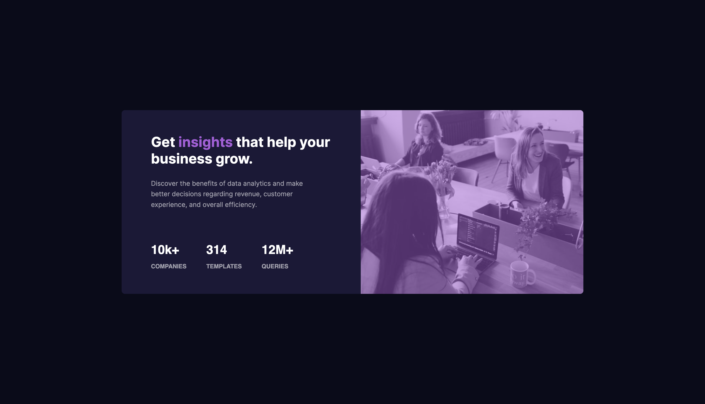

# Frontend Mentor - Stats preview card component solution

This is a solution to the [Stats preview card component challenge on Frontend Mentor](https://www.frontendmentor.io/challenges/stats-preview-card-component-8JqbgoU62). Frontend Mentor challenges help you improve your coding skills by building realistic projects. 

## Table of contents

- [Overview](#overview)
  - [The challenge](#the-challenge)
  - [Screenshot](#screenshot)
  - [Links](#links)
- [My process](#my-process)
  - [Built with](#built-with)
  - [Continued development](#continued-development)
  - [Useful resources](#useful-resources)
- [Author](#author)
- [Acknowledgments](#acknowledgments)


## Overview

### The challenge

Users should be able to:

- View the optimal layout depending on their device's screen size

### Screenshot




### Links

- Solution URL: [click here](https://github.com/Rataash99/Front-End-Mentor_Projects/tree/main/stats-preview-card-component-main)
- Live Site URL: [click here](https://friendly-naiad-a2d3f6.netlify.app/)

## My process

### Built with

- Semantic HTML5 markup
- Flexbox
- Mobile-first workflow

To see how you can add code snippets, see below:

```html
 <div class = "card-main">
        <div>
          <h2 class = "preview-heading">
            Get <span class = "highlight">insights</span> that help your business grow.
          </h2>
          <p class = "preview-para">
            Discover the benefits of data analytics and make better decisions regarding revenue, customer 
            experience, and overall efficiency.
          </p>
        </div>
        <div id = "stats-main">
          <div class = "stats company-stats">
            <h2>10k+<br> <span>COMPANIES</span></h2>
            <!-- <p>COMPANIES</p> -->
          </div>
          <div class = "stats templates-stats">
            <h2>314 <br> <span>TEMPLATES</span></h2>
          </div>
          <div class = "stats queries-stats">
          <h2>12M+ <br> <span>QUERIES</span></h2>
          </div>
        </div>
      </div>
```
```css
#preview-card{
    width: 100vw;
    background-color: hsl(233, 47%, 7%);
    color: white;
    overflow: hidden;
    padding: 5rem 0;;
}
.img-mob{
    width: 100%;
    opacity: 0.5;
    height: 100%;
    display: block;
}
```

### Continued development

I am planning to do one Bootstrap project next.

### Useful resources

- [Font Awesome](https://fontawesome.com) - Different fonts are available here.

## Author

- Frontend Mentor - [@Rataash99](https://www.frontendmentor.io/profile/Rataash99)
- Twitter - [@RohitSingh11299](https://twitter.com/RohitSingh11299)

## Acknowledgments

I would like to thank frontend mentor community for providing us with such amazing projects for improving out front-end skills.

